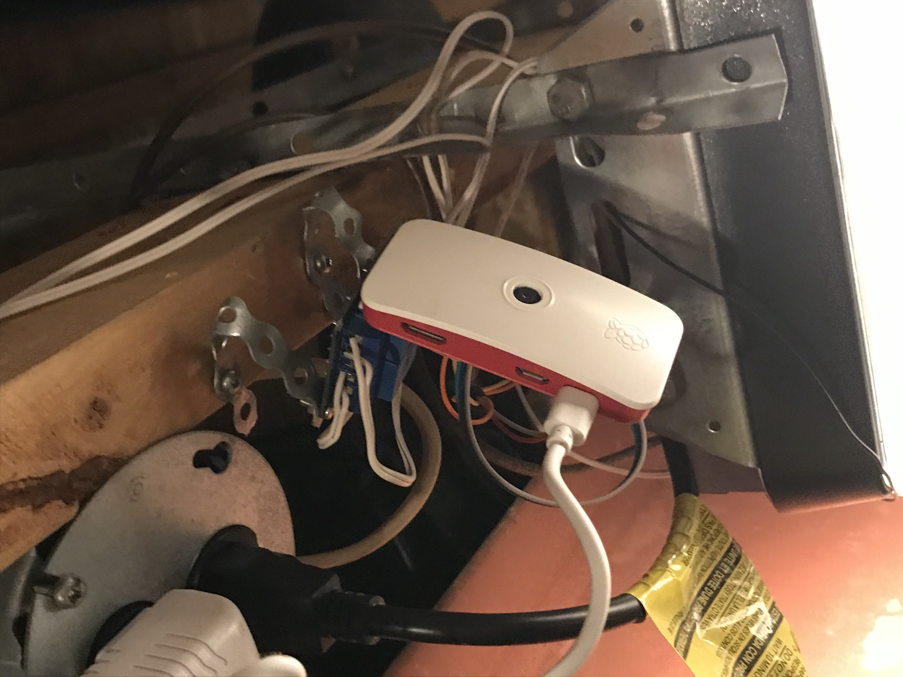

# garage-pi
pi zero to control garage doors

# START AS SERVICE
sudo vi /etc/systemd/system/garage.service\
[Unit]\
Description=garage\
After=network-online.target\
[Service]\
ExecStart=/home/pi/garage-pi/app.py\
[Install]\
WantedBy=multi-user.target\

picamstream service\
sudo vi /etc/systemd/system/picamstream.service\
[Unit]\
Description=picamstream\
After=network-online.target\
[Service]\
ExecStart=/home/pi/garage-pi/picamstream.py\
[Install]\
WantedBy=multi-user.target\

sudo systemctl daemon-reload\
sudo systemctl enable garage\
sudo systemctl enable picamstream\
sudo systemctl restart garage\
sudo systemctl restart picamstream\

# INSTALL OPENCV
sudo pip3 install opencv-python==3.4.6.27\
sudo apt install cmake build-essential pkg-config git\
sudo apt install libjpeg-dev libtiff-dev libjasper-dev libpng-dev libwebp-dev libopenexr-dev\
sudo apt install libavcodec-dev libavformat-dev libswscale-dev libv4l-dev libxvidcore-dev libx264-dev libdc1394-22-dev libgstreamer-plugins-base1.0-dev libgstreamer1.0-dev\
sudo apt install libgtk-3-dev libqtgui4 libqtwebkit4 libqt4-test python3-pyqt5\
sudo apt install libatlas-base-dev liblapacke-dev gfortran\
sudo apt install libhdf5-dev libhdf5-103\

# INSTALL PICAMERA
sudo pip3 install picamera

# INSTALL EVENTLET
sudo pip3 install eventlet --force

# EMAIL NOTIFICATIONS
!!! ssmtp does not work - need to use msmtp !!!\
sudo apt-get install msmtp\
sudo apt-get install msmtp-mta\

pi@pizero:~/garage-pi $ cat ~/.msmtprc\
#Set default values for all following accounts.\
defaults\
auth           on\
tls            on\
tls_trust_file /etc/ssl/certs/ca-certificates.crt\
logfile        ~/.msmtp.log\

#Gmail\
account        gmail\
host           smtp.gmail.com\
port           587\
from           somefakeaccount@gmail.com\
user           somefakeaccount\
password       blahblahblah\

#to test\
echo "hello there username." | msmtp -a default testemail@gmail.com\

#to work from a service - copy to /etc\
sudo cp ~/.msmtp.log /etc/msmtprc\

